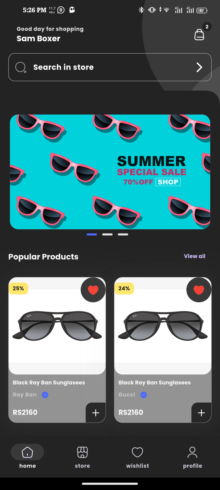
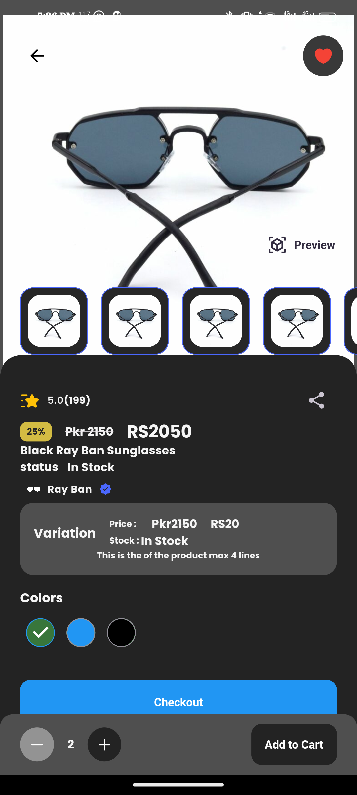
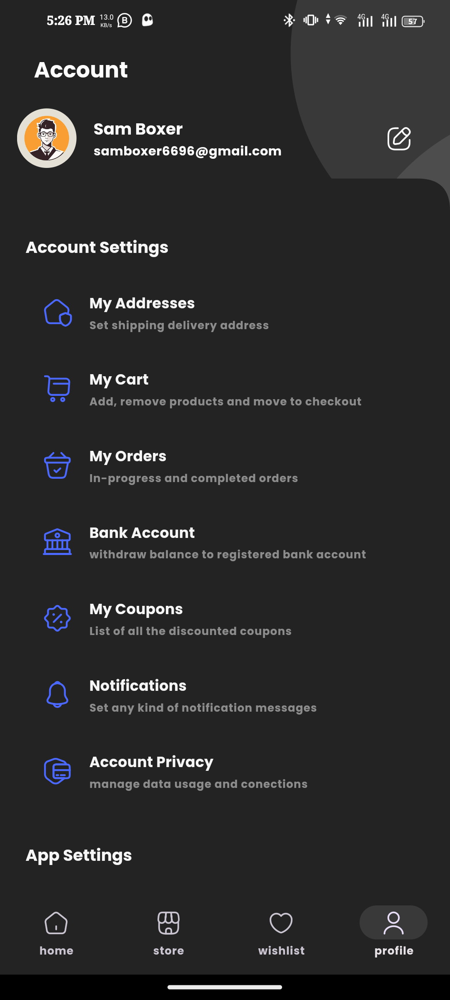
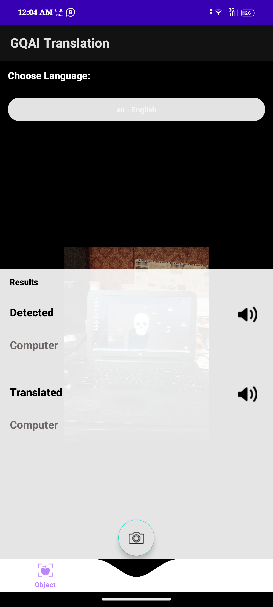
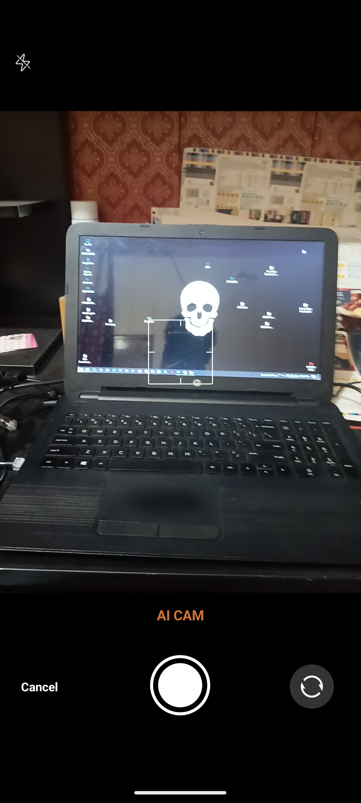
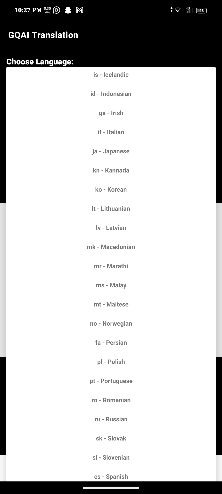

# Rizwan Akbar

### Hello, I am an android developer, always follow best practices for android application and I am always ready to learn new technologies, methods, and principle as per the project requirements. Keep Learning and Keep Sharing

&nbsp;&nbsp;&nbsp;&nbsp;&nbsp;&nbsp;

# LENSIFY Application

Lensify is an innovative online platform that will provide a sustainable and affordable way to buy
and sell pre-owned luxury eyewear. With a wide range of luxury brands and a hassle-free selling
experience, Lensify is disrupting the traditional eyewear market and promoting sustainability in
the industry. The app also have an AI-powered recommendation system that suggests the best
frames and lenses based on the user's face shape, style, and prescription. By providing these
features, Lensify aim to offer a hassle-free and personalized eyewear shopping experience for its
customers.

    
    
    

# GQAI: AI-Based Object and Text Translation Mobile Application

The system uses Object Detection from Google Cloud vision API to recognize the object and it is
a part of Machine Learning (ML). Similarly, for Text, we are using Text Detection from Google
Cloud vision API to recognize the Text, and it is also part of ML.
It translates the text or object into a preferred language. For instance, if a user selects a computer
image and Urdu as the preferred language, Google Translation API will translate the recognized
image and display the message/output in Urdu.
Another option is available here; the same user must pick the image on which text is accessible,
and that text or message will be transformed into the specified language. It will be beneficial if
you do not understand any other language text, message or even handwriting, as you will be able
to convert it into your understandable language. 

    
    
    

## Thanks for stopping!
